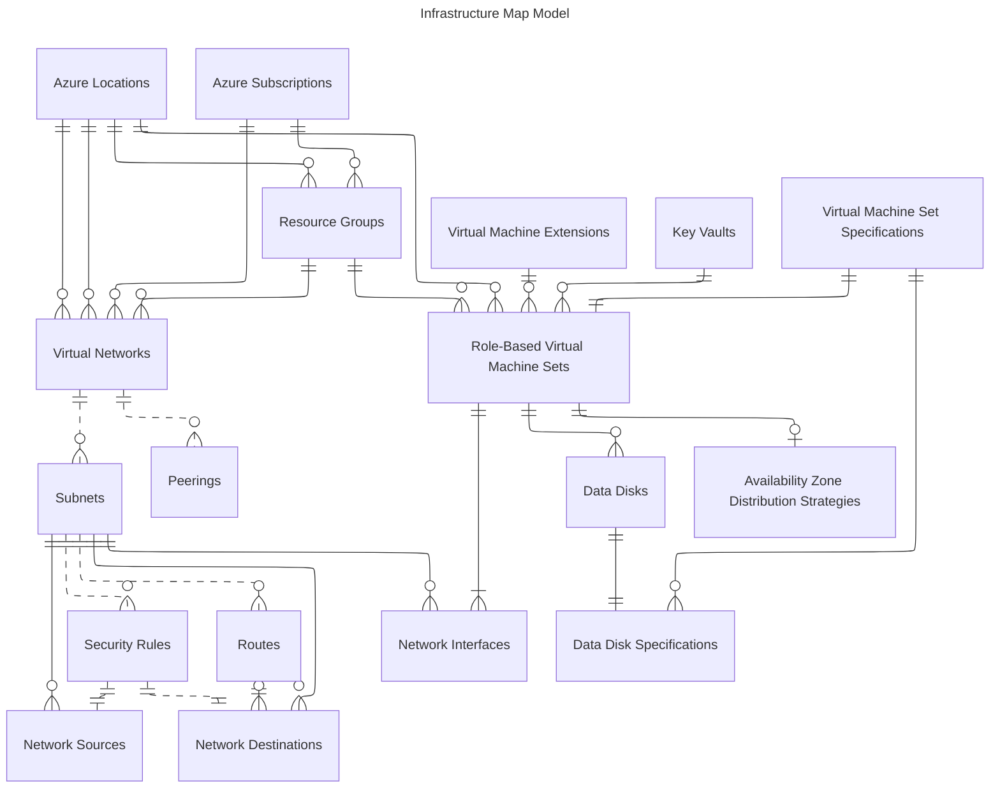

# Epic on Azure Terraform Module Stack

This repo provides a Terraform module stack for deploying Epic on Azure, aligned with the Epic on Azure Well-Architected Framework (WAF) and built on Microsoft’s Azure Verified Modules (AVM).

At the base, the stack uses official AVM resource modules that implement Microsoft’s reliability best practices by default. On top of that, it adds AVM-aligned pattern modules that capture common infrastructure patterns from Epic’s reference architecture—such as role-based virtual machine sets using VMSS Flex with built-in zone distribution.

These modules use normalized, table-style map variables to describe infrastructure across regions, subscriptions, and workloads. Each map functions like a relational database, linking networks, VM sets, resource groups, key vaults, and more through consistent, composable inputs.

All lower layers are generic and reusable. Solution-specific modules, such as the Epic layer, build on top of this foundation. The Epic module will remain private; others may be public or private depending on scenario.

This modular approach supports:

- **Reusability** – Modules are composable and useful on their own.
- **Maintainability** – Focused layers reduce complexity and risk.
- **Shareability** – Only the Epic-specific layer is private; the rest can be reused or published.

## Infrastructure Map Model

This section introduces the normalized infrastructure map that underpins the module stack. It defines Azure infrastructure using a relational-style model—expressed through Terraform map variables—that cleanly connects networks, VM sets, resource groups, and other resources. Epic-specific modules build on this foundation by layering in a domain-specific map of the resources required for a complete Epic environment.

## Contributing

This project welcomes contributions and suggestions.  Most contributions require you to agree to a
Contributor License Agreement (CLA) declaring that you have the right to, and actually do, grant us
the rights to use your contribution. For details, visit https://cla.opensource.microsoft.com.

When you submit a pull request, a CLA bot will automatically determine whether you need to provide
a CLA and decorate the PR appropriately (e.g., status check, comment). Simply follow the instructions
provided by the bot. You will only need to do this once across all repos using our CLA.

This project has adopted the [Microsoft Open Source Code of Conduct](https://opensource.microsoft.com/codeofconduct/).
For more information see the [Code of Conduct FAQ](https://opensource.microsoft.com/codeofconduct/faq/) or
contact [opencode@microsoft.com](mailto:opencode@microsoft.com) with any additional questions or comments.

## Trademarks

This project may contain trademarks or logos for projects, products, or services. Authorized use of Microsoft 
trademarks or logos is subject to and must follow 
[Microsoft's Trademark & Brand Guidelines](https://www.microsoft.com/en-us/legal/intellectualproperty/trademarks/usage/general).
Use of Microsoft trademarks or logos in modified versions of this project must not cause confusion or imply Microsoft sponsorship.
Any use of third-party trademarks or logos are subject to those third-party's policies.
