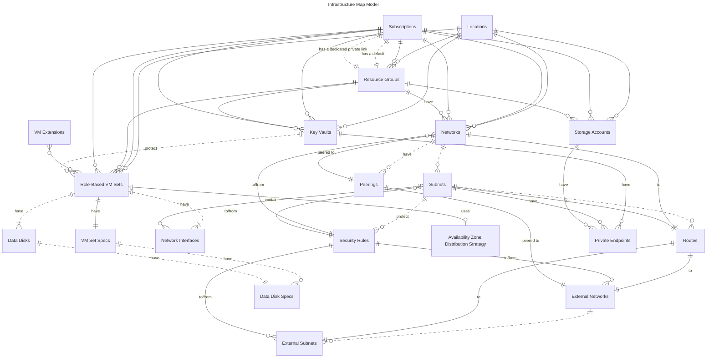

# Epic on Azure Terraform Stack

This repository provides a Terraform module stack for deploying Epic on Azure, aligned with the Epic on Azure Well-Architected Framework (WAF) and built on Microsoft’s Azure Verified Modules (AVM). It’s designed to be both private and reusable, offering a flexible framework for managing Azure infrastructure across multiple subscriptions and workloads. The stack includes a private module for Epic-specific healthcare deployments (e.g., Hyperspace, MyChart) while keeping lower layers generic for broader use cases.

Each layer of the stack is a Terraform module, built to work independently or together. You can use the full stack for Epic on Azure or tap into individual layers for other projects, like setting up reliable virtual machines or organizing complex networks. Infrastructure is defined with table-like map variables (e.g., `infra_map`), which act like a blueprint to connect resources such as networks, VMs, and key vaults.

The stack delivers:
- **Privacy**: Only the Epic module contains sensitive healthcare configurations, kept private for compliance.
- **Reusability**: Lower layers are public and adaptable for any Azure infrastructure project.
- **Simplicity**: Modular design lets you choose the level of complexity you need, from basic resources to full deployments.

## Architecture

The stack is organized as a set of Terraform modules, each adding a specific piece of the puzzle. Think of it as a toolkit: you can use one tool or the whole set, depending on your goal. Here’s how the layers work together:

### 1. Foundation: Azure Verified Modules (AVM)
This layer uses AVM resource modules to deploy core Azure resources like virtual machines, storage accounts, and key vaults, following Microsoft’s best practices for reliability and security. For bigger setups, it includes AVM pattern modules for things like hub-and-spoke networking or Azure Landing Zone (ALZ) configurations, which help with governance and scalability. It’s the starting point for any solid Azure infrastructure, ensuring everything’s built on a trusted, standardized base.

### 2. infra_map_vm_set: Virtual Machine Patterns
The `infra_map_vm_set` module makes it easy to deploy groups of virtual machines that are reliable by default. It’s based on common patterns, like organizing VMs by role (e.g., web servers, databases) and spreading them across Azure Availability Zones for high availability. Using Virtual Machine Scale Sets (VMSS Flex), it supports workloads that need to stay up and running, even during outages. While it draws inspiration from Epic’s 20+ workloads (like MyChart), it’s generic enough for any project needing organized, resilient VMs across regions like Canada Central or France Central.

### 3. infra_map and subscription_infra_map: Infrastructure Blueprints
These modules (`infra_map` and `subscription_infra_map`) let you describe your entire Azure environment like a database. Resources—networks, subscriptions, VM sets, key vaults—are organized into Terraform maps, where each map is like a table with a unique key (e.g., `network_name` or `subscription_name`). For example, you might define a network called `primary_dmz` and link it to a subscription called `main`, with tags to track everything. This setup makes it simple to manage complex, multi-subscription environments and tweak configurations without breaking things. These modules are public and reusable for any Azure project.

### 4. Epic Module: Private Healthcare Deployments
The Epic module is the private capstone, designed specifically for Epic on Azure. It uses the lower layers to deploy healthcare workloads like Hyperspace or MyChart, with preconfigured settings that meet Epic’s requirements (e.g., security, performance). You can customize it with parameters, like choosing regions or sizing VMs, but this layer stays private to protect sensitive details. It’s the only module that mentions Epic, keeping everything else open for broader use.

## Infrastructure Map Model

This section introduces the normalized infrastructure map that underpins the module stack. It defines Azure infrastructure using a relational-style model—expressed through Terraform map variables—that cleanly connects networks, VM sets, resource groups, and other resources. Epic-specific modules build on this foundation by layering in a domain-specific map of the resources required for a complete Epic environment.



> In the sections below, the 🔑 icon represents a "foreign key" property that references another table/map variable.

### Locations
> Terraform variable: `var.locations`

The `locations` variable identifies the model's [Azure locations](https://learn.microsoft.com/azure/reliability/regions-list).

```hcl
locations = {
  primary = "eastus" // Must be a valid Azure location
  alt     = "westus" // Must be a valid Azure location
}
```

### Subscriptions
> Terraform variable: `var.subscriptions`

The `subscriptions` variable identifies the model's [Azure subscriptions](https://learn.microsoft.com/azure/cloud-adoption-framework/ready/azure-setup-guide/organize-resources#management-levels-and-hierarchy).

```hcl
subscriptions = {
  production = {
    default_resource_group_name      = "production"               // 🔑 Must be in var.resource_groups
    private_link_resource_group_name = "production_networks"      // 🔑 Optional; must be in var.resource_groups
    subscription_slot                = "az_subscription_1"        // References a named azurerm provider
  }
  non_production = {
    default_resource_group_name      = "non_production"          
    private_link_resource_group_name = "non_production_networks"
    subscription_slot                = "az_subscription_2"
  }
}
```

* `default_resource_group_name` must refer to a resource group defined in [`var.resource_groups`](#resource-groups).
* When provided, `private_link_resource_group_name` must refer to a resource group defined in [`var.resource_groups`](#resource-groups).
  * If not provided, `default_resource_group_name` will be used.
* `subscription_slot` refers to a static [`azurerm` provider](https://registry.terraform.io/providers/hashicorp/azurerm/latest/docs) alias (`az_subscription_1` - `az_subscription_10`).

### Resource groups
> Terraform variable: `var.resource_groups`

The `resource_groups` variable identifies the model's [Azure resource groups]((https://learn.microsoft.com/azure/cloud-adoption-framework/ready/azure-setup-guide/organize-resources#management-levels-and-hierarchy)).

```hcl
resource_groups = {
  production = {
    subscription_name = "production"      // 🔑 Must be in var.subscriptions
    location_name     = "primary"         // 🔑 Optional; Must be in var.locations
    name              = "production"      // The actual name of the resource group
  }
  non_production = {
    subscription_name = "non_production"
    location_name     = "alt"
    name              = "non-production"
  }
}
```

* `subscription_name` must refer to a subscription defined in [`var.subscriptions`](#subscriptions).
* When provided, `location_name` must refer to a location defined in [`var.locations`](#locations).
  * If no `location_name` is provided, the default (i.e., first location defined in `var.locations`) will be used.

### Virtual machine extensions
> Terraform variable: `var.virtual_machine_extensions`

The `virtual_machine_extensions` variable identifies the model's virtual machine extension configurations. The example below is used to configure the Azure Monitor Agent for Windows.

```hcl
virtual_machine_extensions = {
  azure_monitor = {
    name                       = "AzureMonitorWindowsAgent"
    publisher                  = "Microsoft.Azure.Monitor"
    type                       = "AzureMonitorWindowsAgent"
    type_handler_version       = "1.2"
    auto_upgrade_minor_version = true
    automatic_upgrade_enabled  = true
    settings                   = null
  }
}
```

### Networks
> Terraform variable: `var.networks`

The `networks` variable identifies the model's networks. Note that this is different than external networks (which may be on-premises, in Azure, or in another cloud) defined in `var.external_networks`.

```hcl
  networks = {
    main = {
      location_name       = "primary"      // 🔑 Must be in var.locations
      subscription_name   = "production"   // 🔑 Must be in var.subscriptions
      resource_group_name = "production"   // 🔑 Must be in var.resource_groups
      name                = "main-vnet"    // Optional; if not provided, will be derived from key "main"
      address_space       = "10.0.0.0/16"

      subnets = {
        subnet_a = {
          name            = "subnet-a"     // Optional; if not provided, will be derived from key "subnet_a"
          address_space   = "10.0.0.0/24"
        }
        subnet_b = {
          name            = "subnet-b"
          address_space   = "10.0.1.0/24"
        }
      }     
    }
  }
```

* `subscription_name` must refer to a subscription defined in [`var.subscriptions`](#subscriptions).
* `location_name` must refer to an Azure location defined in [`var.locations`](#locations).
* `resource_group_name` must refer to a resource group in [`var.resource_groups`](#resource-groups).

#### Peerings

The `peerings` section of the `networks` variable describes each network's peerings. These peerings can refer to other networks and subnets described in this model (via `var.networks`) or external networks and subnets (via `var.external_networks`).

```hcl
networks = {
  main = {
    ...

    subnets = {
      ...
    }

    peered_to = [
      "alt"  // Peer this network to the "alt" network declared below
    ]
  }
  alt = {
    ...

    subnets = {
      ...
    }

    peered_to = [
      "main"  // Peer this network to the "main" network declared above
    ]
  }
}
```

* `peered_to` networks must be defined in either `var.networks` or `var.external_networks`.
* Only `var.external_networks` that have a valid Azure `resource_id` can be peered to.

#### Routes

The `routes` section within `subnets`, as defined by the `networks` variable, specifies custom network routes for each subnet. These routes determine how traffic is directed, whether to a network gateway, the Internet, a virtual network appliance, or simply dropped. The sections below demonstrate how to configure `routes` for each of these scenarios. Traffic destinations can be defined either as fixed address spaces in CIDR format or as references to networks and subnets defined in `var.networks` and `var.external_networks`.

> [!IMPORTANT]
> A dedicated route table is created for each network in which you have `routes` defined. If no `routes` are defined, no route table is created.

##### Example: Route traffic to a network gateway for a fixed address space

```hcl
networks = {
  main = {
    ...

    subnets = {
      route_traffic = {
        destined_for = {
          address_space = "192.168.1.0/24"  // Destined for a fixed address space
        }

        to_gateway = true                   // Route traffic to the gateway
      }
    }
  }
}
```

##### Example: Route traffic to the Internet for a network defined in `var.networks` 

```hcl
networks = {
  main = {
    ...

    subnets = {
      route_traffic = {
        destined_for = {
          network_name = "alt"  // Destined for the "alt" network defined below
        }

        to_internet = true      // Route traffic to the Internet
      }
    }
  }

  alt = {                     
    ...
  }
}
```

##### Example: Route traffic to an appliance for a subnet defined in `var.networks`

```hcl
networks = {
  main = {
    ...

    subnets = {
      route_traffic = {
        destined_for = {
          network_name = "alt"        // Route traffic destined for subnet "subnet_b" in
          subnet_name  = "subnet_b"   // network "alt" defined below
        }

        to_appliance = {
          ip_address = "192.168.1.1"  // To an appliance at 192.168.1.1
        }
      }
    }
  }

  alt = {
    ...

    subnets = {
      subnet_b = {
        ...
      }
    }
  }
}
```

##### Example: Drop all traffic destined for the Internet

```hcl
networks = {
  main = {
    ...

    subnets = {
      route_traffic = {
        destined_for = {
          address_space = "0.0.0.0/0"  // Route traffic destined for the Internet
        }

        to_nowhere = true              // to nowhere
      }
    }
  }
}
```

#### Security rules

Each subnet in a virtual network defined in `var.networks` can include layer 4 security rules, which are translated into network security group (NSG) rules in Azure during deployment. This approach uses a straightforward, fluent syntax to define security rules, as illustrated below. These rules allow you to manage:

* Source and destination address ranges
* Source and destination port ranges
* Rule priorities (translated to NSG priorities)

The fluent syntax supports defining address ranges by referencing internal networks and subnets (`var.networks`) as well as external networks and subnets (`var.external_networks`).

> [!IMPORTANT]
> A dedicated network security group is created for each network regardless of whether or not you have `security_rules` configured.

##### Example: Allow traffic in from a static address space

```hcl
networks = {
  main = {
    ...

    subnets = {
      subnet_a = {
        security_rules = {
          priority = "100"                    // Rule priority is 100
          allow = { in = { from = {           // Allow in from...
            address_space = "192.168.1.0/24"  // Address space "192.168.1.0/24"
            port_range    = "443"             // On port 443
          }}}
        }
      }
    }
  }
}
```

##### Example: Allow all traffic in from a network defined in `var.subnets`

```hcl
networks = {
  main = {
    ...

    subnets = {
      subnet_a = {
        security_rules = {
          priority = "110"             // Rule priority is 110
          allow = { in = { from = {    // Allow in from...
            network = {    
              network_name = "alt"     // "alt" network
              port_range   = "100-200" // On any port between 100-200
            }
          }}}
        }
      }
    }
  }

  alt = {
    ...
  }
}
```

##### Example: Deny all inbound traffic from a subnet defined in `var.networks`

```hcl
networks = {
  main = {
    ...

    subnets = {
      subnet_a = {
        security_rules = {
          priority = "120"              // Rule priority is 120
          deny = { in = { from = {      // Deny in from...
            subnet = {    
              network_name = "alt"      // "alt" network
              subnet_name  = "subnet_b" // "subnet_b" subnet
              port_range   = "443"      // On port 443
            }
          }}}
        }
      }
    }
  }

  alt = {
    ...

    subnets = {
      subnet_b = {
        ...
      }
    }
  }
}
```

##### Example: Allow all outbound traffic to a static address space 

```hcl
networks = {
  main = {
    ...

    subnets = {
      subnet_a = {
        security_rules = {
          priority = "130"                    // Rule priority is 130
          allow = { out = { to = {            // Allow out to...
            address_space = "192.168.1.0/24"  // Address space "192.168.1.0/24"
            port_range    = "443"             // On port 443
          }}}
        }
      }
    }
  }
}
```

##### Example: Deny all outbound traffic to a network defined in `var.networks`

```hcl
networks = {
  main = {
    ...

    subnets = {
      subnet_a = {
        security_rules = {
          priority = "140"          // Rule priority is 140
          deny = { out = { to = {   // Deny out to...
            network = {
              network_name = "alt"  // "alt" network
            }

            port_range    = "443"   // On port 443
          }}}
        }
      }
    }
  }

  alt = {
    ...
  }
}
```

##### Example: Allow all outbound traffic to a subnet defined in `var.networks`

```hcl
networks = {
  main = {
    ...

    subnets = {
      subnet_a = {
        security_rules = {
          priority = "150"               // Rule priority is 150
          allow = { out = { to = {       // Allow out to...
            subnet = {
              network_name = "alt"       // "alt" network
              subnet_name  = "subnet_b"  // "subnet_b" subnet
            }

            port_range    = "443"        // On port 443
          }}}
        }
      }
    }
  }

  alt = {
    ...

    subnets = {
      subnet_b = {
        ...
      }
    }
  }
}
```

### Virtual Machine Sets  
> Terraform variable: `var.virtual_machine_sets`  

The `virtual_machine_sets` variable defines highly available virtual machine (VM) sets that share common roles, workloads, and availability characteristics. By default, VMs are evenly distributed across availability zones, but this behavior can be customized using the `var.virtual_machine_set_zone_distribution` variable.  

Key configurations for VM sets, such as VM count, SKU, and disk specifications, are defined in a separate variable: `var.virtual_machine_set_specs`. There is a 1-to-1 relationship between `var.virtual_machine_sets`, `var.virtual_machine_set_specs`, and `var.virtual_machine_set_zone_distribution`. These variables are separated to support automation, as their inputs often come from different sources.  

```hcl
virtual_machine_sets = {
  database = {
    key_vault_name                    = "primary"      // 🔑 Must be in `var.key_vaults`
    location_name                     = "primary"      // 🔑 Must be in `var.locations`
    resource_group_name               = "production"   // 🔑 Must be in `var.resource_groups`
    subscription_name                 = "production"   // 🔑 Must be in `var.subscriptions`
    name                              = "db"           // All VMs in this group will be prefixed with this name
    include_deployment_prefix_in_name = true           // Should `var.deployment_prefix` be applied to all resources? Default: false

    tags = {                                           // Optional
      role = "database"                                // All VMs will be tagged with `role`:`database`
    }

    extensions = [                                     // Optional
      "azure_monitor"                                  // 🔑 Optional; Must be defined in `var.virtual_machine_extensions`
    ]

    os_type                 = "Windows"                // or Linux
    disk_controller_type    = "nvme"                   // Optional; can be either SCSI or NVMe depending on VM SKU
    enable_boot_diagnostics = true                     // Should boot diagnostics be enabled? Default: false
  }
}
```

* `key_vault_name` must refer to a key vault defined in [`var.key_vaults`](#key-vaults).
* `location_name` must refer to an Azure location defined in [`var.locations`](#locations).
* `resource_group_name` must refer to a resource group defined in [`var.resource_groups`](#resource-groups).
* `subscription_name` must refer to an Azure subscription defined in [`var.subscriptions`](#subscriptions).
* `extensions` must include only VM extensions defined in [`var.virtual_machine_extensions`](#virtual-machine-extensions).

#### Virtual Machine Image    

The `image` variable specifies the virtual machine image to be used when deploying VMs. This can be defined either via an image ID or a reference object containing details about the Azure Marketplace image. In Azure, virtual machine images are pre-configured operating system environments that ensure consistency, security, and compliance across deployments.  

#### Example: Use a custom or shared image resource

```hcl
virtual_machine_sets = {
  database = {
    ...

    image = {
      id = "/subscriptions/12345678..."  // This is the resource ID of a custom or shared image
    }
  }
}
```

#### Example: Use an Azure Marketplace image

```hcl
virtual_machine_sets = {
  database = {
    ...

    image = {
      reference = {
        offer     = "UbuntuServer"  // The name of the image offer
        publisher = "Canonical"     // The publisher of the image
        sku       = "18.04-LTS"     // The image type or edition
        version   = "latest"        // The version of the image
      }
    }
  }
}
```

### Virtual Machine Data Disks

The `virtual_machine_set` `data_disks` describes each virtual machine's data disk configuration. Data disks are optional.

```hcl
virtual_machine_sets = {
  database = {
    ...

    data_disks = {
      data = {
        lun                          = 0            // Logical unit number (LUN) is required
        caching                      = "ReadWrite"  // Optional; can be "None", "ReadOnly", or "ReadWrite"; Default: "ReadWrite" 
        enable_public_network_access = true         // Optional; by default, public network access is disabled
      }
      logs = {
        lun = 1          
      }
    }
  }
}
```

##### Example: Import a VHD using a source URI

```hcl

```

##### Example: Copy an existing disk or snapshot

##### Example: Copy a platform image from the Azure Marketplace

##### Example: Restore image from Azure Backup or Site Recovery

## Contributing

This project welcomes contributions and suggestions.  Most contributions require you to agree to a
Contributor License Agreement (CLA) declaring that you have the right to, and actually do, grant us
the rights to use your contribution. For details, visit https://cla.opensource.microsoft.com.

When you submit a pull request, a CLA bot will automatically determine whether you need to provide
a CLA and decorate the PR appropriately (e.g., status check, comment). Simply follow the instructions
provided by the bot. You will only need to do this once across all repos using our CLA.

This project has adopted the [Microsoft Open Source Code of Conduct](https://opensource.microsoft.com/codeofconduct/).
For more information see the [Code of Conduct FAQ](https://opensource.microsoft.com/codeofconduct/faq/) or
contact [opencode@microsoft.com](mailto:opencode@microsoft.com) with any additional questions or comments.

## Trademarks

This project may contain trademarks or logos for projects, products, or services. Authorized use of Microsoft 
trademarks or logos is subject to and must follow 
[Microsoft's Trademark & Brand Guidelines](https://www.microsoft.com/en-us/legal/intellectualproperty/trademarks/usage/general).
Use of Microsoft trademarks or logos in modified versions of this project must not cause confusion or imply Microsoft sponsorship.
Any use of third-party trademarks or logos are subject to those third-party's policies.
