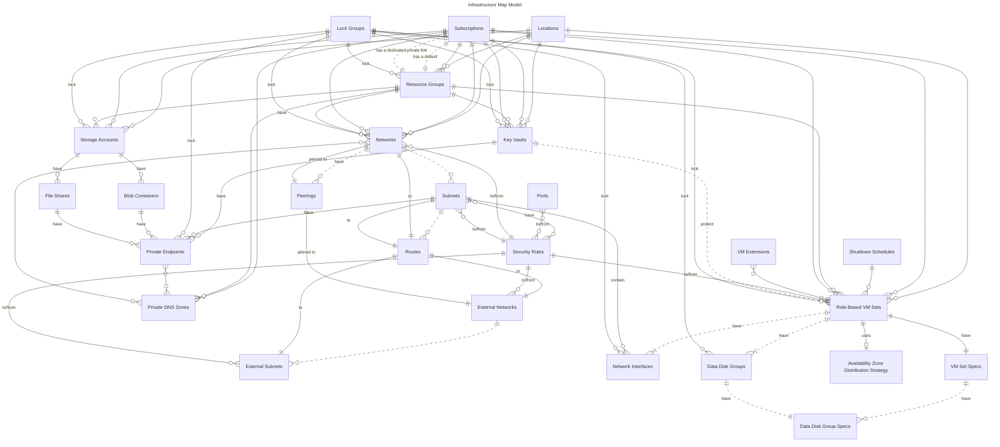

# Azure Relational Infrastructure (AzRI)

Azure Relational Infrastructure (AzRI) simplifies Azure deployments by modeling infrastructure as code (IaC) like a relational database. In the 1970s, relational databases tamed chaotic data with structured tables, primary keys, and foreign keys, making data compact, queryable, and easy to update. Similarly, AzRI organizes Terraform resources into concise maps with clear relationships, slashing code sprawl and complexity. This relational approach mirrors database normalization, eliminating redundancy and simplifying modifications. Built on [Azure Verified Modules (AVM)](https://aka.ms/avm) and aligned with [Azure’s Well-Architected Framework](https://learn.microsoft.com/en-us/azure/well-architected/), AzRI ensures resilient, scalable Terraform deployments. Features like [lock groups](#lock-groups) enhance management, drawing on Microsoft and partner expertise. AzRI makes Azure IaC cleaner and more efficient, just as relational databases transformed data management.

## Model Reference



> [!NOTE]
> In the sections below:
> * 🔑 indicates a "primary key"; typically the "one" side of a one-to-many relationship
> * 🔗 indicates a "foreign key"; typically the "many" side of a one-to-many relationship

### Locations

> Terraform variable: `var.locations`

The `locations` table defines the Azure regions where your infrastructure lives, like `eastus` or `westus`. It’s the starting point for placing resources geographically, ensuring they align with [Azure’s global regions](https://learn.microsoft.com/azure/reliability/regions-list) for availability and compliance. In the entity-relationship diagram (ERD), `locations` acts as a reference point, linking one-to-many with tables like networks or virtual machine sets to specify where they’re deployed.

```hcl
locations = {
  primary = "eastus"  # 🔑 "primary" location; must be a valid Azure region (see below)
  alt     = "westus"  # 🔑 "alt" location; must be a valid Azure region (see below)
}
```

> [!TIP]
> **Powershell Users:** For a complete list of valid Azure locations, [install the Az Powershell module](https://learn.microsoft.com/powershell/azure/install-azure-powershell), then run the following command:
> ```powershell
> Get-AzLocation | Select-Object -Property Name | ForEach-Object { $_.Name }
> ```

> [!TIP]
> **Azure CLI/Bash Users:** For a complete list of valid Azure locations, [install the Azure CLI](https://learn.microsoft.com/en-us/cli/azure/install-azure-cli), then run the following command:
> ```bash
> az account list-locations --query "[].name" -o tsv
> ```

### Subscriptions

> Terraform variable: `var.subscriptions`

> [!IMPORTANT]
> Up to ten (10) subscriptions are supported.

The `subscriptions` table organizes your [Azure subscriptions](https://learn.microsoft.com/azure/cloud-adoption-framework/ready/azure-setup-guide/organize-resources#management-levels-and-hierarchy), acting as a control center for grouping resources across your environment. Each subscription connects to [resource groups](#resource-groups) and Terraform providers, setting the scope for your infrastructure. In the entity-relationship diagram (ERD), `subscriptions` serves as a central hub, with one-to-many links to tables like [`resource_groups`](#resource-groups) and [`networks`](#networks), ensuring resources stay aligned.

```hcl
subscriptions = { 
  production = {                                                  # 🔑 "production" subscription
    default_resource_group_name      = "production"               # 🔗 Links to var.resource_groups
    private_link_resource_group_name = "production_networks"      # 🔗 Optional; links to var.resource_groups
    subscription_id                  = "00000000-0000..."         # Azure subscription ID (must be a GUID)
  }
  non_production = {                                              # 🔑 "non_production" subscription
    default_resource_group_name      = "non_production"           # 🔗 Links to var.resource_groups    
    private_link_resource_group_name = "non_production_networks"  # 🔗 Optional; Links to var.resource_groups
    subscription_id                  = "10000000-0000..."         # Azure subscription ID (must be a GUID)
  }
}
```

| Field | Description |
|-------|-------------|
| `default_resource_group_name` | Links to a key in [`var.resource_groups`](#resource-groups). Defines the primary resource group for the subscription. |
| `private_link_resource_group_name` | Optional; if set, links to a key in [`var.resource_groups`](#resource-groups) for private link resources. Defaults to `default_resource_group_name` if unset. |
| `subscription_id` | References a specific Azure subscription ID. Must be a GUID. |

### Lock Groups

> Terraform variable: `var.lock_groups`

The `lock_groups` table groups Azure resources—like [VMs](#virtual-machine-sets), [networks](#networks), or [disks](#virtual-machine-data-disks)—into logical sets for coordinated [lock management](https://learn.microsoft.com/azure/azure-resource-manager/management/lock-resources) during maintenance, such as updating a region’s infrastructure or a compute tier. Resources in tables like [`var.virtual_machine_sets`](#virtual-machine-sets) or [`var.networks`](#networks) can list lock group keys in their `lock_groups` property to join one or more groups. Each group toggles locks (CanNotDelete or ReadOnly) for its members. 

This is how lock groups work:

* If the resource has no `lock_groups`, the resource is unlocked.
* If any of the resource's `lock_groups` are unlocked, the resource is unlocked.
* If all of a resource group's `lock_groups` are locked and any of the `lock_groups` are configured for `read_only`, a read-only lock is applied to the resource.
* If all of a resource group's `lock_groups` are locked and none of the `lock_groups` are configured for `read_only`, a do-not-delete lock is applied to the resource.

In the ERD, `lock_groups` has a many-to-many relationship with resources, linked via `lock_groups` properties in other tables.

```hcl
lock_groups = {
  production_lock = {      # 🔑 Primary key: "production_lock"
    locked    = true       # Locks enabled
    read_only = true       # ReadOnly lock
  }
  non_production_lock = {  # 🔑 Primary key: "maintenance_lock"
    locked    = false      # Locks disabled
    read_only = false      # CanNotDelete lock
  }
}
```

> [!IMPORTANT]  
> When a resource belongs to multiple locked groups (via its `lock_groups` property), the most restrictive lock wins: a ReadOnly lock (`read_only = true`) takes precedence over a CanNotDelete lock (`read_only = false`).

| Field | Description |
|-------|-------------|
| `locked` | Required; if `true`, applies locks to group resources; if `false`, removes them for maintenance. |
| `read_only` | Optional; if `true`, applies ReadOnly locks (no changes); if `false`, applies CanNotDelete locks (allows updates). Defaults to `false`. ReadOnly wins if multiple locked groups apply. |

### Resource Groups

> Terraform variable: `var.resource_groups`

The `resource_groups` table defines the [Azure resource groups](https://learn.microsoft.com/azure/cloud-adoption-framework/ready/azure-setup-guide/organize-resources#management-levels-and-hierarchy) that bundle related resources together in your environment. Each resource group ties to a subscription and, optionally, a location, organizing assets like networks or VMs. In the entity-relationship diagram (ERD), `resource_groups` links one-to-one with `subscriptions` and optionally to `locations`, acting as a container for other resources.

```hcl
resource_groups = {
  production = {                         # 🔑 "production" resource group
    subscription_name = "production"     # 🔗 Links to var.subscriptions
    location_name     = "primary"        # 🔗 Optional; links to var.locations
    name              = "production"     # Resource group name in Azure

    lock_groups = [
      "production_lock"                  # 🔗 Optional; links to var.lock_groups
    ]
  }
  non_production = {                     # 🔑 "non_production" resource group
    subscription_name = "non_production" # 🔗 Links to var.subscriptions
    location_name     = "alt"            # 🔗 Optional; links to var.locations
    name              = "non-production" # Resource group name in Azure

    lock_groups = [
      "non_production_lock"              # 🔗 Optional; links to var.lock_groups
    ]
  }
}
```

| Field | Description |
|-------|-------------|
| `subscription_name` | Links to a key in [`var.subscriptions`](#subscriptions). Defines the subscription this resource group belongs to. |
| `location_name` | Optional; if set, links to a key in [`var.locations`](#locations). Specifies the Azure region for the resource group. Defaults to the first location in `var.locations` if unset. |
| `lock_groups` | Optional; if set, links to keys in [`var.lock_groups`](#lock-groups). Specifies the resource lock groups that this resource group belongs to. |
| `name` | The name of the resource group as it appears in Azure, used to identify it. |

### Maintenance Schedules

> Terraform variable: `var.maintenance_schedules`

[The `maintenance_schedules` table defines when Azure applies platform updates](https://learn.microsoft.com/azure/virtual-machines/maintenance-configurations), like patches or upgrades, to your [virtual machines](#virtual-machine-sets). Each schedule specifies a start time, update period, and how often updates repeat (daily, weekly, or monthly). In the ERD, `maintenance_schedules` links one-to-one with [`subscriptions`](#subscriptions) and one-to-many with [`virtual_machine_sets`](#virtual-machine-sets), aligning update plans with your infrastructure.

```hcl
maintenance_schedules = {
  guest_updates = {                                # 🔑 Primary key: "guest_updates"
    repeat_every = {                               # Updates every...
      week = true                                  # week
    }
    start_date_time_utc = "2025-01-05 22:00"       # Window starts at 22:00
    duration            = "2:00"                   # Updates take 2 hours
  }
  host_updates = {                                 # 🔑 Primary key: "host_updates"
    repeat_every = {                               # Updates every...
      days = 7                                     # 7 days
    }
    start_date_time_utc      = "2025-01-06 23:00"  # Window starts at 23:00
    expiration_date_time_utc = "2026-01-06 23:00"  # Expires after 1 year
    duration                 = "1:30"              # Updates take 90 minutes
  }
}
```

> [!IMPORTANT]  
> [VMs](#virtual-machine-sets) must be running 15 minutes before the update start time. Schedule updates during low-traffic periods to avoid impact.

| Field | Description |
|-------|-------------|
| `repeat_every` | Required; sets the update frequency: `day` (daily), `week` (weekly), `month` (monthly), `days` (every n days), `weeks` (every n weeks), or `months` (every n months). Only one option can be set. |
| `start_date_time_utc` | Required; specifies the first update time in UTC, e.g., `2025-01-05 22:00`. |
| `expiration_date_time_utc` | Optional; sets when the schedule ends, e.g., `2026-01-06 23:00`. Defaults to `null` (no expiration). |
| `duration` | Optional; defines the update period in HH:MM format, e.g., `2:00` or `1:30`. Defaults to `1:30` (90 minutes). Minimum varies by scope (e.g., 1.5h for guest updates). |

### Shutdown Schedules

> Terraform variable: `var.virtual_machine_shutdown_schedules`

The `virtual_machine_shutdown_schedules` table defines daily [shutdown schedules for Azure virtual machines](https://learn.microsoft.com/azure/virtual-machines/auto-shutdown-vm), helping to reduce costs by automatically powering off VMs during off-hours. Each schedule specifies a shutdown time, timezone, and optional notifications (e.g., email or webhook alerts before shutdown). Schedules link to [`virtual_machine_sets`](#virtual-machine-sets) via the `shutdown_schedule_name` field, allowing multiple VM sets to share the same schedule. In the ERD, `virtual_machine_shutdown_schedules` has a one-to-many relationship with [`virtual_machine_sets`](#virtual_machine-sets), enabling efficient management of shutdown policies across your infrastructure.

```hcl
virtual_machine_shutdown_schedules = {
  evening_shutdown = {                               # 🔑 "evening_shutdown" schedule
    daily_recurrence_time = "1800"                   # Shutdown at 6:00 PM (24-hour format, no colon)
    timezone              = "Pacific Standard Time"  # Timezone for the schedule
    enabled               = true                     # Schedule is active

    notification_settings = {
      enabled         = true                        # Enable notifications
      email           = "admin@example.com"         # Email for alerts
      time_in_minutes = "30"                        # Notify 30 minutes before shutdown
      webhook_url     = "https://webhook.example.com"  # Optional webhook for notifications
    }

    tags = {
      purpose = "cost_savings"                      # Optional tags
    }
  }
  weekend_shutdown = {                               # 🔑 "weekend_shutdown" schedule
    daily_recurrence_time = "2200"                   # Shutdown at 10:00 PM
    timezone              = "Eastern Standard Time"  # Timezone for the schedule
    enabled               = false                    # Schedule is disabled
  }
}
```

| Field | Description |
|-------|-------------|
| `daily_recurrence_time` | Required; specifies the daily shutdown time in 24-hour format without a colon, e.g., `1800` for 6:00 PM. |
| `timezone` | Required; sets the timezone for the schedule, e.g., `Pacific Standard Time`. Must be a valid Azure timezone string. |
| `enabled` | Optional; if `true`, activates the schedule. Defaults to `true`. |
| `notification_settings` | Optional; configures pre-shutdown notifications with `enabled` (defaults to `false`), `email` (optional), `time_in_minutes` (defaults to `"30"`), and `webhook_url` (optional). Defaults to `{ enabled = false }`. |
| `tags` | Optional; applies key-value tags to the schedule, e.g., `{ purpose = "cost_savings" }`. Defaults to `null`. |

> [!NOTE]  
> Shutdown schedules are applied at the VM level and trigger daily based on the specified time and timezone. Notifications, if enabled, send alerts via email or webhook a set number of minutes before shutdown to allow for any necessary actions.

### Virtual Machine Extensions

> Terraform variable: `var.virtual_machine_extensions`

The `virtual_machine_extensions` table sets up extensions for [Azure VMs](#virtual-machine-sets), adding capabilities like monitoring or management tools. It defines settings such as publisher, type, and versioning for consistent application across your environment. In the ERD, `virtual_machine_extensions` links one-to-many to [`virtual_machine_sets`](#virtual-machine-sets), letting multiple VM sets share the same extension config—like the [Azure Monitor Agent](https://learn.microsoft.com/en-us/azure/azure-monitor/agents/azure-monitor-agent-overview) for Windows shown below.

```hcl
virtual_machine_extensions = {
  azure_monitor = {  // 🔑 "azure_monitor" extension
    name                       = "AzureMonitorWindowsAgent"
    publisher                  = "Microsoft.Azure.Monitor"
    type                       = "AzureMonitorWindowsAgent"
    type_handler_version       = "1.2"
    auto_upgrade_minor_version = true
    automatic_upgrade_enabled  = true
    settings                   = null
  }
}
```

| Field | Description |
|-------|-------------|
| `name` | Identifies the extension within the VM, e.g., `AzureMonitorWindowsAgent`. |
| `publisher` | Specifies the extension’s provider, like `Microsoft.Azure.Monitor`. |
| `type` | Defines the extension type, such as `AzureMonitorWindowsAgent`. |
| `type_handler_version` | Sets the extension handler version, e.g., `1.2`. |
| `auto_upgrade_minor_version` | Enables automatic minor version updates if `true`. |
| `automatic_upgrade_enabled` | Activates automatic upgrades for the extension if `true`. |
| `settings` | Optional; holds custom settings for the extension, or `null` if unused. |

### Private DNS Zones

> Terraform variable: `var.private_dns_zones`

The `private_dns_zones` table provisions [Azure Private DNS Zones](https://learn.microsoft.com/azure/dns/private-dns-overview).

* Private endpoints can refer to these zones by name when configuring DNS.
* [Networks](#networks) can refer to these zones by name for both DNS registration and resolution.

```hcl
private_dns_zones = {
  key_vault_private_endpoints = {                            # 🔑 "key_vault_private_endpoints" DNS zone
    domain_name         = "privatelink.vaultcore.azure.net"  # Must be a valid domain name
    resource_group_name = "production"                       # 🔗 Links to var.resource_groups
    subscription_name   = "production"                       # 🔗 Links to var.subscriptions
  }
}
```

> [!NOTE]
> [Private endpoints for Azure services require specific domain names.](https://learn.microsoft.com/azure/private-link/private-endpoint-dns) In the example provided above, `privatelink.vaultcore.azure.net` is the required domain name for Key Vault private endpoints.

### Network Ports

> Terraform variable: `var.network_ports`

The `network_ports` table maps port names to port numbers. These ports are used when configuring [security rules](#security-rules).

The example below illustrates some commonly used ports.

```hcl
network_ports = {
  http  = "80"    # 🔑 "http" port
  https = "443"   # 🔑 "https" port
  rdp   = "3389"  # 🔑 "rdp" port
  ssh   = "22"    # 🔑 "ssh" port
}
```

### Network Security Rules

> Terraform variable: `var.network_security_rules`

The `network_security_rules` names layer 4 network security rules that can be applied to subnets defined in the [`networks`](#networks) table. These security rules can be applied to zero or more subnets. Each subnet can have zero or more security rules defined in this table. These rules are ultimately expressed as [network security groups (NSG)](https://learn.microsoft.com/azure/virtual-network/network-security-groups-overview) applied to each subnet defined in the [`networks`](#networks) table. 

Network security rules are implemented using an easy-to-read fluent syntax that supports traffic filtering to/from:

* Specific address spaces
* Networks defined in [`networks`](#networks)
* External networks defined in [`external_networks`](#external-networks)
* Specific network subnets defined in [`networks`](#networks)
* Specific external network subnets defined in [`external_networks`](#external-subnets)
* Role-based VM sets defined in [`virtual_machine_sets`](#virtual-machine-sets)

Each network security rule can specify optional inbound/outbound ports as defined in the [`network_ports`](#network-ports) table.

Each rule can also specify a protocol (e.g., `Tcp`, `Udp`). By default, all protocols are included in the rule's scope.

#### Example Rule: Deny all traffic to `main` network

```hcl
network_security_rules = {
  deny_all_to_network = {        # 🔑 Named security rule
    deny = {
      in = {
        to = {
          network = {            # ❌ Deny inbound to network...
            name = "main"        # 🔗 Linked to var.networks or var.external_networks
          }
        }
      }
    }
  }
}
```

#### Example Rule: Allow all HTTP/S traffic from `alt` network to `production` subnet on `main` network

```hcl
network_security_rules = {
  allow_all_http_s_from_alt_to_main_production = {  # 🔑 Named security rule
    port_names = [                                  # 🔗 Optional; links to `var.network_ports`
      "http",
      "https"
    ]

    allow = {
      in = {                                        # ✅ Allow inbound...
        from = {
          network = {                               # From network...
            name = "alt"                            # 🔗 Linked to var.networks or var.external_networks
          }
        }
        to = {                
          subnet = {                                # To subnet...
            network_name = "main"                   # 🔗 Linked to var.networks or var.external_networks
            subnet_name  = "production"             # 🔗 Subnet defined on linked network
          }
        }
      }
    }
  }
}
```

#### Example Rule: Allow all TCP traffic out from `10.100.0.0/16` space to `app` VM set

```hcl
network_security_rules = {
  allow_all_tcp_from_on_prem_to_app_vm_set = {  # 🔑 Named security rule
    protocol = "Tcp"                            # Optional; Tcp protocol only

    allow = {
      out = {                                   # ✅ Allow outbound...
        from = {
          address_space = "10.100.0.0/16"       # From address space 10.100.0.0/16
        }
        to = {
          vm_set = {                            # To role-based VM set
            name = "app"                        # 🔗 Linked to var.virtual_machine_sets
          }
        }
      }
    }
  }
}
```

### Networks

> Terraform variable: `var.networks`

The `networks` table defines the virtual networks (VNets) in your Azure environment, distinct from external networks (e.g., on-premises or other clouds) covered in `var.external_networks`. It organizes VNets and their subnets, linking them to [subscriptions](#subscriptions), [locations](#locations), and [resource groups](#resource-groups). In the ERD, `networks` connects one-to-many with `subnets` and one-to-one with [`subscriptions`](#subscriptions), [`locations`](#locations), and [`resource_groups`](#resource-groups), anchoring your network topology.

```hcl
networks = {
  main = {                                         # 🔑 "main" network
    location_name       = "primary"                # 🔗 Links to var.locations
    subscription_name   = "production"             # 🔗 Links to var.subscriptions
    resource_group_name = "production"             # 🔗 Links to var.resource_groups
    name                = "main-vnet"              # Optional; defaults to key 🔑 "main" if unset
    address_space       = "10.0.0.0/16"            # Defines network address space in CIDR format

    lock_groups = [
      "production_lock"                            # 🔗 Optional; links to var.lock_groups
    ]

    private_dns_zones = {                          
      registration_zone_name = "registration_zone" # 🔗 Optional; links to var.private_dns_zones 
                                                   # Only one registration zone is supported
      resolution_zone_names = [                    # 🔗 Optional; links to var.private_dns_zones
        "resolution_zone"                          # Multiple resolution zones are supported
      ]
    }

    subnets = {
      subnet_a = {                       # 🔑 "subnet_a" subnet
        name            = "subnet-a"     # Optional; defaults to key 🔑 "subnet_a" if unset
        address_space   = "10.0.0.0/24"  # Defines "subnet_a" address space in CIDR format

        security_rules = [               # 🔗 Optional; links to var.network_security_rules
          "allow_from_on_prem_to_apps"   # When specified, rules will be added to an underlying
          "deny_all_to_subnet_a"         # network security group in the order they're defined here
        ]
      }

      subnet_b = {                                 # 🔑 "subnet_b" subnet
        name            = "subnet-b"               # Optional, defaults to key 🔑 "subnet_b" if unset
        address_space   = "10.0.1.0/24"            # Defines "subnet_a" address space in CIDR format
      }
    }
  }
}
```

| Field | Description |
|-------|-------------|
| `location_name` | Links to a key in [`var.locations`](#locations), specifying the Azure region for the VNet. |
| `subscription_name` | Links to a key in [`var.subscriptions`](#subscriptions), tying the VNet to a subscription. |
| `resource_group_name` | Links to a key in [`var.resource_groups`](#resource-groups), defining the resource group for the VNet. |
| `private_dns_zones` | Optional; if set, links to [`var.private_dns_zones`](#private-dns-zones). Specifies both registration and resolution DNS zones. |
| `lock_groups` | Optional; if set, links to keys in [`var.lock_groups`](#lock-groups). Specifies the resource lock groups that this VNet belongs to. |
| `name` | Optional; names the VNet in Azure, defaults to the map key (e.g., `main`) if not set. |
| `address_space` | Defines the VNet’s IP address range, e.g., `10.0.0.0/16`. |
| `subnets` | A nested map of subnets, each with a `name` (optional, defaults to key) and `address_space` for its IP range. |

#### Peerings

> Terraform variable: `var.networks.peered_to`

The `peerings` section within the [`networks`](#networks) table sets up virtual network peerings, connecting [VNets within this model (`var.networks`)](#networks) or to [external networks (`var.external_networks`)](#external-networks). It enables traffic flow between networks, like linking a primary and alternate VNet. In the ERD, `peerings` represents a many-to-many relationship between [`networks`](#networks), or between [`networks`](#networks) and [`external_networks`](#external-networks), facilitating flexible network topologies.

> [!IMPORTANT]
> Network peerings are a one-way connection. Each `peered_to` entry establishes traffic flow from the source network to the target network only. For two-way communication, you must configure reciprocal peerings in both directions (e.g., `main` to `alt` and `alt` to `main`).

```hcl
networks = {
  main = {         # 🔑 "primary" network
                   # Other fields like location_name, subnets...
    peered_to = [  # Multiple peerings can be declared
      "alt"        # 🔗 Links to var.networks
    ]
  }
  alt = {          # 🔑 "alt" network
                   # Other fields like location_name, subnets...
    peered_to = [  # Multiple peerings can be declared
      "main"       # 🔗 Links to var.networks
    ]
  }
}
```

| Field | Description |
|-------|-------------|
| `peered_to` | A list of network keys from [`var.networks`](#networks) or [`var.external_networks`](#external-networks) to peer with. For `external_networks`, a valid Azure `resource_id` is required. |

#### Routes

> Terraform variable: `var.networks.subnets.route_traffic`

The `route_traffic` section is an optional map within each subnet of the [`networks`](#networks) table, defining custom routing rules for that subnet. Each route directs traffic to gateways, the Internet, appliances, or nowhere (dropped), with destinations as CIDR address spaces, networks, or networks and subnets declared in [`var.networks`](#networks) and [`var.external_networks`](#external-networks). In the ERD, `route_traffic` is a one-to-many child of `subnets`, linking to [`networks`](#networks) or `subnets` via `destined_for`. A route table is created per subnet only if `route_traffic` is defined.

```hcl
networks = {
  main = {                                      # 🔑 "main" network
    # Other fields...
    subnets = {
      subnet_a = {                              # 🔑 "subnet_a" subnet
        address_space = "10.0.0.0/24"           # Subnet address space in CIDR format
        route_traffic = {                       # Traffic routing rules
          gateway_route = {                     # 🔑 "gateway_route" route
            destined_for = {                    # When traffic is destined for...
              address_space = "192.168.1.0/24"  # the "192.168.1.0/24" address space...
            }
            to_gateway = true                   # route to the default network gateway
          }
          internet_route = {                    # 🔑 "internet_route" route
            destined_for = {                    # When traffic is destined for...
              network = {                       # Network defined in var.networks or var.external_networks...
                network_name = "alt"            # 🔗 linked to "alt" network in var.networks
              }
            }
            to_internet = true                  # route to the Internet
          }
          appliance_route = {                   # 🔑 "appliance_route" route
            destined_for = {                    # When traffic is destined for...
              subnet = {                        # Subnet defined in var.networks or var.external_networks...
                network_name = "alt"            # 🔗 linked to "alt" network in var.networks
                subnet_name  = "subnet_b"       # 🔗 linked to "subnet_b" subnet in var.networks.subnets
              }
            }
            to_appliance = {                    # route to a virtual appliance...
              ip_address = "192.168.1.1"        # running at "192.168.1.1"
            }
          }
          drop_route = {                        # 🔑 "drop_route" route
            destined_for = {                    # When traffic is destined for...
              address_space = "0.0.0.0/0"       # the Internet (0.0.0.0/0)...
            }
            to_nowhere = true                   # drop it
          }
        }
      }
    }
  }
  alt = {                                       # 🔑 "alt" network
    # Other fields...
    subnets = {
      subnet_b = {                              # 🔑 "subnet_b" subnet
        address_space = "10.1.0.0/24"           # Subnet address space in CIDR format
      }
    }
  }
}
```

> [!IMPORTANT]  
> A dedicated route table is created for each subnet with `route_traffic` defined. If no routes are specified, no route table is created.

| Field | Description |
|-------|-------------|
| `destined_for` | Required; sets the traffic target: `address_space` (CIDR, e.g., `192.168.1.0/24`), `network` (links to [`var.networks`](#networks) via `network_name`), or `subnet` (links to [`var.networks`](#networks) via `network_name` and `subnet_name`). |
| `route_name` | Optional; names the route, defaults to `null` (auto-generated). |
| `to_gateway` | Optional; if `true`, routes to a network gateway. Defaults to `false`. |
| `to_internet` | Optional; if `true`, routes to the Internet. Defaults to `false`. |
| `to_nowhere` | Optional; if `true`, drops traffic. Defaults to `false`. |
| `to_appliance` | Optional; routes to an appliance with `ip_address` (e.g., `192.168.1.1`). Defaults to `null`. |

### External Networks

> Terraform variable: `var.external_networks`

The `external_networks` table captures networks outside this model, unlike those defined in [`var.networks`](#networks). These can be on-premises, in Azure, or in another cloud, allowing your infrastructure to interact with them via [routing](#routes), [security rules](#security-rules), or [peering](#peerings). By specifying their address spaces and subnets, you can reference them in [`var.networks`](#networks) configurations. For Azure-based external networks, including a `resource_id` enables one-way [peering](#peerings) from [`var.networks`](#networks), provided you have sufficient permissions. In the ERD, `external_networks` links many-to-many with [`networks`](#networks) through [`peered_to`](#peerings), [`route_traffic`](#routes), and [`security_rules`](#security-rules), with `subnets` as a one-to-many child.

```hcl
external_networks = {                                  
  on_prem_network = {                                 # 🔑 "on_prem_network" external network
    address_space = "10.10.0.0/16"                    # External network address space can be used for
                                                      # configuring routes and security rules
    subnets = {
      on_prem_database = {                            # 🔑 "on_prem_database" external subnet
        name          = "DatabaseSubnet"              
        address_space = "10.10.0.0/24"                # External subnet address space can be used for
      }                                               # configuring routes and security rules
    }
  }

  external_azure_network = {                          # 🔑 "external_azure_network" external network
    address_space = "10.20.0.0/16"                    # External network address space can be used for
                                                      # configuring routes and security rules
    resource_id   = "/subscriptions/12345678..."      # External Azure network resource ID enables seamless
                                                      # var.networks to var.external_networks peering                                               
    subnets = {
      external_service = {                            # 🔑 "external_service" subnet                
        name          = "ServiceSubnet"
        address_space = "10.20.0.0/24"                # External subnet address space can be used for
      }                                               # configuring routes and security rules
    }
  }
}
```

| Field | Description |
|-------|-------------|
| `address_space` | Required; defines the external network’s IP range, e.g., `10.10.0.0/16`, used in routes and security rules. |
| `resource_id` | Optional; Azure resource ID for peering from [`var.networks`](#networks), e.g., `/subscriptions/12345678...`. Requires permissions. Defaults to `null`. |
| `subnets` | Optional; maps subnets with `name` (e.g., `DatabaseSubnet`) and `address_space` (e.g., `10.10.0.0/24`) for detailed routing and security configs. Defaults to `{}`. |

### Virtual Machine Sets

> Terraform variable: `var.virtual_machine_sets`

The `virtual_machine_sets` table configures groups of highly available VMs that share the same role, workload, and availability settings. By default, VMs are spread evenly across [Azure availability zones](https://learn.microsoft.com/azure/reliability/availability-zones-overview?tabs=azure-cli), with [custom distribution possible via `var.virtual_machine_set_zone_distribution`](#virtual-machine-set-zone-distribution). Related specs like VM count, SKU, and disks are defined in [`var.virtual_machine_set_specs`](#virtual-machine-set-specs), maintaining a 1:1 link with `virtual_machine_sets` and [`virtual_machine_set_zone_distribution`](#virtual-machine-set-zone-distribution) to streamline automation. In the ERD, `virtual_machine_sets` connects one-to-one with [`subscriptions`](#subscriptions), [`resource_groups`](#resource-groups), [`locations`](#locations), and [`key_vaults`](#key-vaults), and one-to-many with nested `extensions` and `data_disks`.

```hcl
virtual_machine_sets = {
  database = {                                             # 🔑 "database" VM set                                        
    key_vault_name                    = "primary"          # 🔗 Links to var.key_vaults
    location_name                     = "primary"          # 🔗 Links to var.locations
    resource_group_name               = "production"       # 🔗 Links to var.resource_groups
    subscription_name                 = "production"       # 🔗 Links to var.subscriptions
    shutdown_schedule_name            = "evening_shutdown" # 🔗 Optional; links to var.virtual_machine_shutdown_schedules
    name                              = "db"               # Prefix for all VMs in this set
    include_deployment_prefix_in_name = true               # Apply var.deployment_prefix? Default: false

    tags = {
      role = "database"                                    # Optional; tags all VMs
    }

    extensions = [                                         # Optional
      "azure_monitor"                                      # 🔗 Links to var.virtual_machine_extensions
    ]

    lock_groups = [                                        # Optional
      "production_lock"                                    # 🔗 Links to var.lock_groups
    ]

    maintenance = {                                        # Optional
      schedule_name = "guest_updates"                      # 🔗 Optional; links to var.maintenance_schedules
    }

    os_type                 = "Windows"                    # Windows or Linux
    disk_controller_type    = "nvme"                       # Optional; SCSI or NVMe based on SKU
    enable_boot_diagnostics = true                         # Enable boot diagnostics? Default: false
  }
}
```

| Field | Description |
|-------|-------------|
| `key_vault_name` | Links to a key in [`var.key_vaults`](#key-vaults), specifying the key vault for the VM set. |
| `location_name` | Links to a key in [`var.locations`](#locations), setting the Azure region for the VMs. |
| `resource_group_name` | Links to a key in [`var.resource_groups`](#resource-groups), defining the resource group for the VMs. |
| `subscription_name` | Links to a key in [`var.subscriptions`](#subscriptions), tying the VMs to a subscription. |
| `lock_groups` | Optional; if set, links to keys in [`var.lock_groups`](#lock-groups). Specifies the resource lock groups that this VM set belongs to. By default, all child resources including disks and network interfaces inherit these lock groups. |
| `maintenance.schedule_name` | Optional; if set, links to keys in [`var.maintenance_schedules`](#maintenance-schedules). Specifies the maintenance schedule that should be used when applying guest updates for the VMs. |
| `shutdown_schedule_name` | Optional; if set, links to keys in [`var.virtual_machine_shutdown_schedules`](#shutdown-schedules). Applies a shutdown schedule to the VM set. |
| `name` | Prefixes all VMs in the set, used in their Azure names. |
| `include_deployment_prefix_in_name` | If `true`, prepends `var.deployment_prefix` to resource names. Default: `false`. |
| `tags` | Optional; applies key-value tags to all VMs, e.g., `role: database`. |
| `extensions` | Optional; lists extensions from [`var.virtual_machine_extensions`](#virtual-machine-extensions) to apply. |
| `os_type` | Specifies the OS: `Windows` or `Linux`. |
| `disk_controller_type` | Optional; sets disk controller to `SCSI` or `NVMe` based on VM SKU. |
| `enable_boot_diagnostics` | If `true`, enables boot diagnostics. Default: `false`. |

> [!TIP]
> Lock groups can be overridden on VM set child resources. See [data disk groups](#virtual-machine-data-disk-groups) and [network interfaces](#virtual-machine-network-interfaces) for more information.

#### Virtual Machine Image

> Terraform variable: `var.virtual_machine_sets.image`

The `image` section within [`virtual_machine_sets`](#virtual-machine-sets) selects the OS image for VMs, ensuring consistency and compliance. It can reference a custom/shared image by ID or an Azure Marketplace image by details like offer and publisher. In the ERD, `image` is a child of [`virtual_machine_sets`](#virtual-machine-sets), with a one-to-one relationship.

```hcl
virtual_machine_sets = {
  database = {                        # 🔑 "database" VM set
                                      # Other fields...
    image = {
      reference = {
        offer     = "UbuntuServer"    # Image offer name
        publisher = "Canonical"       # Image publisher
        sku       = "18.04-LTS"       # Image edition
        version   = "latest"          # Image version
      }
    }
  }
}

# Or, for a custom image:
# image = {
#   id = "/subscriptions/12345678..."  # Resource ID of custom/shared image
# }
```

| Field | Description |
|-------|-------------|
| `id` | Optional; resource ID for a custom or shared image, e.g., `/subscriptions/12345678...`. |
| `reference` | Optional; defines a Marketplace image with `offer`, `publisher`, `sku`, and `version`. |

#### Virtual Machine Data Disk Groups

> Terraform variable: `var.virtual_machine_sets.data_disk_groups`

The `data_disk_groups` section within [`virtual_machine_sets`](#virtual-machine-sets) configures groups of data disks attached to VMs in a set, enabling scenarios like disk striping for high-performance workloads (e.g., SQL Server). Each group defines shared properties such as caching, encryption, and source images, with disks assigned contiguous Logical Unit Numbers (LUNs) for consistent attachment order. In the ERD, `data_disk_groups` is a one-to-many child of [`virtual_machine_sets`](#virtual-machine-sets), linking to [`key_vaults`](#key-vaults) for encryption and [`lock_groups`](#lock-groups) for resource protection. The number of disks and their sizes are specified in [`var.virtual_machine_set_specs.data_disk_groups`](#virtual-machine-set-disk-specs), ensuring a one-to-one key alignment between the two tables.

```hcl
virtual_machine_sets = {
  database = {                                         # 🔑 "database" VM set
                                                       # Other fields...
    data_disk_groups = {
      data = {                                         # 🔑 "data" disk group
        caching                      = "ReadOnly"      # ReadOnly caching for performance
        enable_public_network_access = false           # Disable public access
        disk_encryption_set_id       = "/subscriptions/12345678..."  # Optional; encryption set ID

        image = {                                      # Optional; disk source
          copy = {                                     # Copy from an existing managed disk
            resource_id = "/subscriptions/12345678/resourceGroups/rg/providers/Microsoft.Compute/disks/source-disk"
          }
        }

        lock_groups = [                               # Optional; overrides parent VM set lock groups
          "data_disk_lock"                            # 🔗 Links to var.lock_groups
        ]
      }
      logs = {                                         # 🔑 "logs" disk group
        caching                      = "ReadWrite"    # ReadWrite caching
        enable_public_network_access = false          # Disable public access
      }
    }
  }
}
```

| Field | Description |
|-------|-------------|
| `caching` | Optional; configures caching: `None`, `ReadOnly`, or `ReadWrite`. Defaults to `ReadWrite`. Optimizes performance for workloads like SQL Server striping. |
| `disk_encryption_set_id` | Optional; specifies a disk encryption set ID (e.g., `/subscriptions/12345678...`) from Azure Key Vault for encryption. Defaults to `null`. |
| `enable_public_network_access` | Optional; if `true`, allows public access to disks in the group for specific use cases. Defaults to `false` for security. |
| `image` | Optional; defines the disk group’s source: `copy` (from a disk/snapshot), `import` (from a VHD), `platform` (from a Marketplace image), `restore` (from a backup/snapshot), or `null` (empty disks). Defaults to `null`. |
| `lock_groups` | Optional; links to keys in [`var.lock_groups`](#lock-groups). Specifies lock groups for the disk group, overriding those defined in the parent [`virtual_machine_sets`](#virtual-machine-sets). Defaults to `[]`. |

> [!NOTE]  
> Each disk group is assigned contiguous LUNs automatically, starting from the lowest available LUN for the VM set. For example, if the `data` group has 3 disks and `logs` has 2, LUNs might be assigned as 0–2 for `data` and 3–4 for `logs`. This supports striping configurations for high-performance workloads.

##### Image Configuration Options

The `image` field in `data_disk_groups` specifies the source for disks in the group, supporting various scenarios like copying existing disks, importing VHDs, using Marketplace images, or restoring from backups. Below are examples for each option, using the same fluent syntax as the [`network_security_rules`](#network-security-rules) section.

###### Example: Copy Disks from an Existing Managed Disk

This configuration copies disks from an existing Azure managed disk or snapshot, useful for replicating pre-configured disk setups.

```hcl
virtual_machine_sets = {
  database = {                                         # 🔑 "database" VM set
                                                       # Other fields...
    data_disk_groups = {
      data = {                                         # 🔑 "data" disk group
        caching = "ReadOnly"                          # Optimize for read-heavy workloads
        image = {
          copy = {                                     # Copy from an existing managed disk
            resource_id = "/subscriptions/12345678/resourceGroups/rg/providers/Microsoft.Compute/disks/source-disk"
          }
        }
      }
    }
  }
}
```

###### Example: Import Disks from a VHD File

This configuration imports disks from a VHD file stored in Azure Blob Storage, ideal for migrating existing disk images.

```hcl
virtual_machine_sets = {
  database = {                                         # 🔑 "database" VM set
                                                       # Other fields...
    data_disk_groups = {
      data = {                                         # 🔑 "data" disk group
        caching = "ReadWrite"                         # Enable read/write caching
        image = {
          import = {                                   # Import from a VHD
            uri    = "https://storage.blob.core.windows.net/vhds/sample.vhd"
            secure = true                              # Perform secure import
          }
        }
      }
    }
  }
}
```

###### Example: Use a Platform Image for Disks

This configuration uses a platform image from the Azure Marketplace, suitable for standardized disk setups.

```hcl
virtual_machine_sets = {
  database = {                                         # 🔑 "database" VM set
                                                       # Other fields...
    data_disk_groups = {
      data = {                                         # 🔑 "data" disk group
        caching = "ReadOnly"                          # Optimize for read-heavy workloads
        image = {
          platform = {                                # Use a platform image
            image_reference_id = "/subscriptions/12345678/resourceGroups/rg/providers/Microsoft.Compute/images/ubuntu-18.04"
          }
        }
      }
    }
  }
}
```

###### Example: Restore Disks from a Backup

This configuration restores disks from an Azure Backup snapshot, useful for disaster recovery scenarios.

```hcl
virtual_machine_sets = {
  database = {                                         # 🔑 "database" VM set
                                                       # Other fields...
    data_disk_groups = {
      data = {                                         # 🔑 "data" disk group
        caching = "ReadWrite"                         # Enable read/write caching
        image = {
          restore = {                                 # Restore from a backup
            resource_id = "/subscriptions/12345678/resourceGroups/rg/providers/Microsoft.Compute/snapshots/backup-snapshot"
          }
        }
      }
    }
  }
}
```

###### Example: Create Empty Disks

This configuration creates empty disks, ideal for initializing new storage without pre-existing data.

```hcl
virtual_machine_sets = {
  database = {                                         # 🔑 "database" VM set
                                                       # Other fields...
    data_disk_groups = {
      data = {                                         # 🔑 "data" disk group
        caching = "ReadWrite"                         # Enable read/write caching
      }
    }
  }
}
```

#### Virtual Machine Network Interfaces

> Terraform variable: `var.virtual_machine_sets.network_interfaces`

The `network_interfaces` section within [`virtual_machine_sets`](#virtual-machine-sets) configures the network connectivity for VMs, linking them to specific VNets and subnets. Each interface specifies a network, subnet, and IP settings, with options for accelerated networking. In the ERD, `network_interfaces` is a one-to-many child of [`virtual_machine_sets`](#virtual-machine-sets), with one-to-one links to [`networks`](#networks) and `subnets` via `network_name` and `subnet_name`, ensuring each VM set connects to the right network topology.

> [!IMPORTANT]
> Only one network interface per VM can have [accelerated networking](https://learn.microsoft.com/azure/virtual-network/accelerated-networking-overview?tabs=redhat) enabled (`enable_accelerated_networking = true`). By default, this feature is enabled. If the VM has multiple network interfaces, you must explicitly indicate which network interfaces should not have accelerated networking enabled (`enable_accelerated_networking = false`). 

```hcl
virtual_machine_sets = {
  database = {                                         # 🔑 "database" VM set
                                                       # Other fields...
    network_interfaces = {
      primary_nic = {                                  # 🔑 "primary_nic" network interface
        network_name                  = "main"         # 🔗 Links to var.networks
        subnet_name                   = "subnet_a"     # 🔗 Links to var.networks.main.subnets
        private_ip                    = "10.0.0.10"    # Optional; static IP
        private_ip_allocation         = "Static"       # Optional; static or dynamic
        enable_accelerated_networking = true           # Optional; boost network performance.
                                                       # See __Important__ accelerated networking note above.

        lock_groups = [                                # Optional; overrides lock groups defined on parent VM set
          "nic_lock"                                   # 🔗 Links to var.lock_groups
        ]
      }
    }
  }
}
```

| Field | Description |
|-------|-------------|
| `network_name` | Required; links to a key in [`var.networks`](#networks), specifying the VNet for the interface. |
| `subnet_name` | Required; links to a subnet key within the specified `network_name` in [`var.networks`](#networks). |
| `lock_groups` | Optional; if set, links to keys in [`var.lock_groups`](#lock-groups). Specifies the resource lock groups that this network interface belongs to. These lock groups override lock groups defined at the [parent VM set](#virtual-machine-set) level. |
| `private_ip` | Optional; sets a static private IP address, e.g., `10.0.0.10`. Defaults to `null` for dynamic allocation. |
| `private_ip_allocation` | Optional; defines IP assignment: `Static` or `Dynamic`. Defaults to `Dynamic`. |
| `enable_accelerated_networking` | Optional; if `true`, enables accelerated networking for better performance. Defaults to `true`. |

### Virtual Machine Set Specs

> Terraform variable: `var.virtual_machine_set_specs`

The `virtual_machine_set_specs` table defines the sizing and storage specs for each VM set in [`virtual_machine_sets`](#virtual-machine-sets), linked one-to-one by a shared key. It pairs with [`virtual_machine_sets`](#virtual-machine-sets) and [`virtual_machine_set_zone_distribution` (for custom zone adjustments)](#virtual-machine-set-zone-distribution) to complete the VM setup. In the ERD, `virtual_machine_set_specs` connects one-to-one with [`virtual_machine_sets`](#virtual-machine-sets), anchoring compute and storage details.

```hcl
virtual_machine_set_specs = {
  database = {                                # 🔑 "database" VM set
    vm_count = 3                              # There are 3 VMs in this set
    sku_size = "Standard_D4ads_v5"            # All VMs are size Standard_D4ads_v5
    os_disk = {                                
      disk_size_gb         = 128              # OS disk is 128 GiB
      storage_account_type = "Premium_LRS"    # Can be Standard_LRS, Premium_LRS, StandardSSD_ZRS, or Premium_ZRS
    }
    data_disks = {                            
      data = {                                # 🔑 "data" data disk
        disk_size_gb         = 128            # "data" disk is 128 GiB
        storage_account_type = "Premium_LRS"  # Can be Standard_LRS, StandardSSD_ZRS, Premium_LRS, PremiumV2_LRS, StandardSSD_LRS or UltraSSD_LRS
      }
      logs = {                                # 🔑 "logs" data disk
        disk_size_gb         = 256            # "logs" disk is 256 GiB
        storage_account_type = "Premium_LRS"  # Can be Standard_LRS, StandardSSD_ZRS, Premium_LRS, PremiumV2_LRS, StandardSSD_LRS or UltraSSD_LRS
      }
    }
  }
}
```

| Field | Description |
|-------|-------------|
| `vm_count` | Optional; sets the number of VMs in the set, e.g., `3`. Defaults to `2`. |
| `sku_size` | Required; specifies the VM SKU, e.g., `Standard_D4ads_v5`, defining compute power. |
| `os_disk` | Required; configures the OS disk with `disk_size_gb` (e.g., `128`) and `storage_account_type` (e.g., `Premium_LRS`, defaults to `PremiumV2_LRS`). |
| `data_disks` | Optional; maps data disks with `disk_size_gb` and `storage_account_type`, aligning with `var.virtual_machine_sets.data_disks` keys. |

#### Virtual Machine Set Data Disk Group Specs

> Terraform variable: `var.virtual_machine_set_specs.data_disk_groups`

The `data_disk_groups` subsection within [`virtual_machine_set_specs`](#virtual-machine-set-specs) defines the sizing and storage specifications for data disk groups in [`virtual_machine_sets.data_disk_groups`](#virtual-machine-data-disk-groups). Each group specifies the number of disks, their size, and storage type, with optional IOPS settings for performance tuning. Keys must match those in [`var.virtual_machine_sets.data_disk_groups`](#virtual-machine-data-disk-groups) for a one-to-one relationship. In the ERD, `data_disk_groups` is a one-to-many child of [`virtual_machine_set_specs`](#virtual-machine-set-specs), ensuring consistent disk configurations across VM sets.

```hcl
virtual_machine_set_specs = {
  database = {                                # 🔑 "database" VM set
                                              # Other fields...
    data_disk_groups = {
      data = {                                # 🔑 "data" disk group
        disk_count           = 3              # 3 disks in the group
        disk_size_gb         = 128            # Each disk is 128 GiB
        storage_account_type = "Premium_LRS"  # Premium locally redundant storage
        disk_iops_read_write = 5000           # 5000 IOPS for read/write operations
      }
      logs = {                                # 🔑 "logs" disk group
        disk_count           = 2              # 2 disks in the group
        disk_size_gb         = 256            # Each disk is 256 GiB
        storage_account_type = "Premium_LRS"  # Premium locally redundant storage
        disk_iops_read_only  = 3000           # 3000 IOPS for read-only operations
      }
    }
  }
}
```

| Field | Description |
|-------|-------------|
| `disk_count` | Optional; specifies the number of disks in the group, e.g., `3`. Defaults to `1`. Useful for striping scenarios like SQL Server. |
| `disk_size_gb` | Required; sets the size of each disk in the group in gigabytes, e.g., `128`. |
| `storage_account_type` | Optional; specifies the storage type: `Standard_LRS`, `StandardSSD_ZRS`, `Premium_LRS`, `PremiumV2_LRS`, `StandardSSD_LRS`, or `UltraSSD_LRS`. Defaults to `PremiumV2_LRS`. |
| `disk_iops_read_write` | Optional; sets IOPS for read/write operations, e.g., `5000`. Defaults to `null` (provider default). |
| `disk_iops_read_only` | Optional; sets IOPS for read-only operations, e.g., `3000`. Defaults to `null` (provider default). |

> [!IMPORTANT]  
> Ensure the `disk_count` aligns with workload requirements, as increasing the number of disks in a group can enhance performance for striped configurations but may increase costs. Verify that `storage_account_type` supports the chosen IOPS settings, as some types (e.g., `UltraSSD_LRS`) are required for high IOPS.

### Virtual Machine Set Zone Distribution

> Terraform variable: `var.virtual_machine_set_zone_distribution`

The `virtual_machine_set_zone_distribution` table adjusts the placement of VMs from [`virtual_machine_sets`](#virtual-machine-sets) across [Azure availability zones](https://learn.microsoft.com/azure/reliability/availability-zones-overview?tabs=azure-cli), overriding the default even distribution (across all three zones) set by `infra_map_vm_set`. It shares a one-to-one relationship with [`virtual_machine_sets`](#virtual-machine-sets) and [`virtual_machine_set_specs`](#virtual-machine-set-specs) via a common key, used only when custom zone allocations are needed, like for capacity constraints. In the ERD, `virtual_machine_set_zone_distribution` links one-to-one with [`virtual_machine_sets`](#virtual-machine-sets), tailoring zonal deployment for each set. 

> [!NOTE]
> If no zone distribution is configured for a [VM set defined in `var.virtual_machine_sets`](#virtual-machine-sets), VMs in that set will be distributed evenly across all three availability zones.

```hcl
virtual_machine_set_zone_distribution = {
  primary_bca_web = {  # 🔗 Links to var.virtual_machine_sets
    custom = {         # Custom distribution    
      "1" = 2          # 2 VMs in zone 1
      "2" = 8          # 8 VMs in zone 2
    }
  }
  database = {         # 🔗 Links to var.virtual_machine_sets
    even = [           # Distribute VMs evenly across zones 1 and 3
      "1",             
      "3"
    ]
  }
}
```

| Field | Description |
|-------|-------------|
| `custom` | Optional; maps zone numbers (e.g., `"1"`, `"2"`) to specific VM counts (e.g., `2`, `8`) for targeted distribution. Defaults to `null`. |
| `even` | Optional; lists zones (e.g., `["1", "3"]`) for even VM distribution across those zones. Defaults to `null`. If both `custom` and `even` are `null`, VMs spread evenly across all zones. |

### Storage Accounts

> Terraform variable: `var.storage_accounts`

The `storage_accounts` table configures [Azure storage accounts](https://learn.microsoft.com/azure/storage/common/storage-account-overview) to store data such as [blobs](https://learn.microsoft.com/azure/storage/blobs/storage-blobs-overview) and [files](https://learn.microsoft.com/azure/storage/files/storage-files-introduction). Each account specifies its [location](#locations), [resource group](#resource-groups), and [subscription](#subscriptions), with options for [access tiers](https://learn.microsoft.com/azure/storage/blobs/access-tiers-overview) and [replication](https://learn.microsoft.com/azure/storage/common/storage-redundancy). In the ERD, `storage_accounts` links one-to-one with [`subscriptions`](#subscriptions), [`locations`](#locations), and [`resource_groups`](#resource-groups), and one-to-many with [`blob_containers`](#blob-containers) and [`file_shares`](#file-shares).

```hcl
storage_accounts = {
  files = {  # 🔑 Primary key: "files"
    location_name       = "primary"      # 🔗 Links to var.locations
    resource_group_name = "shared"       # 🔗 Links to var.resource_groups
    subscription_name   = "primary"      # 🔗 Links to var.subscriptions
    name                = "appfiles"
    replication_type    = "RAGRS"
  }
}
```

| Field | Description |
|-------|-------------|
| `location_name` | Required; links to a key in [`var.locations`](#locations), setting the storage account’s Azure region. |
| `resource_group_name` | Required; links to a key in [`var.resource_groups`](#resource-groups), defining the storage account’s resource group. |
| `subscription_name` | Required; links to a key in [`var.subscriptions`](#subscriptions), tying the storage account to a subscription. |
| `name` | Optional; names the storage account, e.g., `appfiles`. Defaults to `null` (auto-generated if unset). |
| `access_tier` | Optional; sets the access tier: `Hot` or `Cool`. Defaults to `Hot`. |
| `account_tier` | Optional; sets the performance tier: `Standard` or `Premium`. Defaults to `Standard`. |
| `account_type` | Optional; specifies the account kind: `StorageV2`, `Storage`, `BlobStorage`, or `FileStorage`. Defaults to `StorageV2`. |
| `replication_type` | Optional; sets data replication: `LRS`, `GRS`, `RAGRS`, `ZRS`, `GZRS`, and `RAGZRS`. Defaults to `ZRS`. |
| `allow_http_access` | Optional; if `true`, enables HTTP access. Defaults to `false` for security. |
| `include_deployment_prefix_in_name` | Optional; if `true`, prepends a deployment prefix to the name. Defaults to `true`. |
| `lock_groups` | Optional; lists lock groups for resource protection, e.g., `["main_lock"]`. Defaults to `[]`. |
| `tags` | Optional; applies key-value tags, e.g., `{ environment = "production" }`. Defaults to `{}`. |

> [!WARNING]
> We strongly recommend that you allow storage account HTTPS access only (`allow_http_access = false`). This is the default.

### Blob Containers

> Terraform variable: `var.blob_containers`

The `blob_containers` table configures [Azure Blob Storage](https://learn.microsoft.com/azure/storage/blobs/storage-blobs-overview) containers within [storage accounts](#storage-accounts) to store unstructured data like files or backups. Each container specifies its storage account and name, with an option for public access. In the ERD, `blob_containers` links one-to-one with [`storage_accounts`](#storage-accounts) via `storage_account_name`.

```hcl
blob_containers = {
  uploaded_files = {                # 🔑 Primary key: "uploaded_files"
    storage_account_name = "files"  # 🔗 Links to var.storage_accounts
    name                 = "uploaded-files"
  }
}
```

| Field | Description |
|-------|-------------|
| `storage_account_name` | Required; links to a key in [`var.storage_accounts`](#storage_accounts), specifying the storage account for the container. |
| `name` | Required; names the blob container, e.g., `uploaded-files`. |
| `enable_public_network_access` | Optional; if `true`, allows public access to the container. Defaults to `false` for security. |

### File Shares

> Terraform variable: `var.file_shares`

The `file_shares` table configures [Azure File Shares](https://learn.microsoft.com/azure/storage/files/storage-files-introduction) within [storage accounts](#storage-accounts) for shared file storage accessible via [SMB](https://learn.microsoft.com/azure/storage/files/files-smb-protocol?tabs=azure-portal) or [NFS](https://learn.microsoft.com/azure/storage/files/files-nfs-protocol) protocols. Each share specifies its storage account, name, and storage quota, with options for access tier and protocol. In the ERD, `file_shares` links one-to-one with [`storage_accounts`](#storage-accounts) via `storage_account_name`.

```hcl
file_shares = {
  uploaded_files = {                # 🔑 Primary key: "uploaded_files"
    storage_account_name = "files"  # 🔗 Links to var.storage_accounts
    name                 = "uploaded-files"
    quota_gb             = 1
  }
}
```

| Field | Description |
|-------|-------------|
| `storage_account_name` | Required; links to a key in [`var.storage_accounts`](#storage_accounts), specifying the storage account for the file share. |
| `name` | Required; names the file share, e.g., `uploaded-files`. |
| `quota_gb` | Required; sets the storage limit in gigabytes, e.g., `1`. |
| `access_tier` | Optional; sets the access tier: `Hot`, `Cool`, or `TransactionOptimized`. Defaults to `Hot`. |
| `protocol` | Optional; specifies the access protocol: `SMB` or `NFS`. Defaults to `SMB`. |

### Key Vaults

> Terraform variable: `var.key_vaults`

The `key_vaults` table configures Azure Key Vaults for secure storage of secrets, keys, and certificates, requiring a location, subscription, and resource group as its foundation. Commonly used optional fields like SKU, tags, and network ACLs enhance its setup. 

```hcl
key_vaults = {
  primary = {                                # 🔑 "primary" key vault
    location_name       = "primary"          # 🔗 Links to var.locations
    subscription_name   = "main"             # 🔗 Links to var.subscriptions
    resource_group_name = "main_key_vaults"  # 🔗 Links to var.resource_groups
    sku_name            = "standard"         # Optional; standard or premium

    lock_groups = [                          # Optional
      "production_lock"                      # 🔗 Links to var.lock_groups
    ]

    tags = {
      env = "production"                     # Optional; custom tags
    }

    network_acls = {
      bypass         = "AzureServices"       # Optional; allow Azure services
      default_action = "Allow"               # Optional; default access rule
    }
  }
  alt = {                                    # 🔑 "alt" key vault
    location_name       = "alt"              # 🔗 Links to var.locations
    subscription_name   = "main"             # 🔗 Links to var.subscriptions
    resource_group_name = "main_key_vaults"  # 🔗 Links to var.resource_groups
    sku_name            = "standard"         # Optional; standard or premium

    lock_groups = [                          # Optional
      "non_production_lock"                  # 🔗 Links to var.lock_groups
    ]

    tags = {
      env = "production"                     # Optional; custom tags 
    }

    network_acls = {
      bypass         = "AzureServices"       # Optional; allow Azure services
      default_action = "Allow"               # Optional; default access rule
    }
  }
}
```

| Field | Description |
|-------|-------------|
| `location_name` | Required; links to a key in [`var.locations`](#locations), setting the vault’s Azure region. |
| `subscription_name` | Required; links to a key in [`var.subscriptions`](#subscriptions), tying the vault to a subscription. |
| `resource_group_name` | Required; links to a key in [`var.resource_groups`](#resource-groups), defining the vault’s resource group. |
| `lock_groups` | Optional; if set, links to keys in [`var.lock_groups`](#lock-groups). Specifies the resource lock groups that the vault belongs to. |
| `sku_name` | Optional; sets the vault SKU: `standard` or `premium`. Defaults to `standard`. |
| `tags` | Optional; applies key-value tags, e.g., `env: production`. Defaults to `{}`. |
| `network_acls` | Optional; configures network access with `bypass` (e.g., `AzureServices`) and `default_action` (e.g., `Allow`). Defaults to `{}`. |

## Contributing

This project welcomes contributions and suggestions.  Most contributions require you to agree to a
Contributor License Agreement (CLA) declaring that you have the right to, and actually do, grant us
the rights to use your contribution. For details, visit https://cla.opensource.microsoft.com.

When you submit a pull request, a CLA bot will automatically determine whether you need to provide
a CLA and decorate the PR appropriately (e.g., status check, comment). Simply follow the instructions
provided by the bot. You will only need to do this once across all repos using our CLA.

This project has adopted the [Microsoft Open Source Code of Conduct](https://opensource.microsoft.com/codeofconduct/).
For more information see the [Code of Conduct FAQ](https://opensource.microsoft.com/codeofconduct/faq/) or
contact [opencode@microsoft.com](mailto:opencode@microsoft.com) with any additional questions or comments.

## Trademarks

This project may contain trademarks or logos for projects, products, or services. Authorized use of Microsoft 
trademarks or logos is subject to and must follow 
[Microsoft's Trademark & Brand Guidelines](https://www.microsoft.com/en-us/legal/intellectualproperty/trademarks/usage/general).
Use of Microsoft trademarks or logos in modified versions of this project must not cause confusion or imply Microsoft sponsorship.
Any use of third-party trademarks or logos are subject to those third-party's policies.
