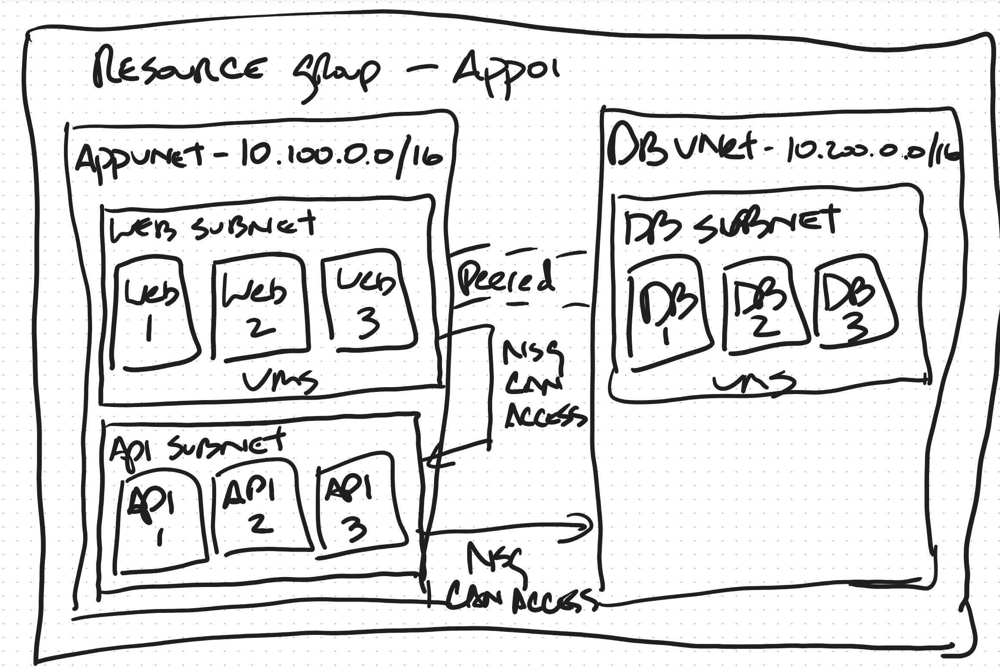

# Example 01: Peered VNets — Three-Tier App

## The Diagram

<!-- Place the whiteboard image here -->

## What the Diagram Shows

A hand-drawn whiteboard sketch of a classic three-tier application inside a single resource group ("App01"):

- **AppVNet** (10.100.0.0/16) containing a Web Subnet (3 VMs) and an API Subnet (3 VMs)
- **DB VNet** (10.200.0.0/16) containing a DB Subnet (3 VMs)
- A dashed **"Peered"** line connecting the two VNets
- Two **"NSG Can Access"** annotations — one between the VNets and one with a curved arrow from API Subnet toward DB Subnet

## How the TFVARS Were Generated

The diagram was given to an AI agent along with the AzRI system prompt. The AI performed an exhaustive visual inventory of every box, label, arrow, and annotation, then mapped each element to the relational model.

### Diagram element → TFVARS structure

| Diagram Element | TFVARS Structure |
|---|---|
| Outer box labeled "Resource Group — App01" | `resource_groups.app01` |
| "AppVNet — 10.100.0.0/16" box | `networks.app_vnet` with explicit CIDR |
| "DB VNet — 10.200.0.0/16" box | `networks.db_vnet` with explicit CIDR |
| Web Subnet with 3 VM boxes | `networks.app_vnet.subnets.web` + `virtual_machine_sets.web` |
| API Subnet with 3 VM boxes | `networks.app_vnet.subnets.api` + `virtual_machine_sets.api` |
| DB Subnet with 3 VM boxes | `networks.db_vnet.subnets.db` + `virtual_machine_sets.db` |
| Dashed "Peered" line | `peered_to` on both VNets (bidirectional) |
| "NSG Can Access" arrow from API → DB | `network_security_rules.allow_api_to_db` |
| Implied deny (no arrow from Web to DB) | `network_security_rules.deny_all_inbound_to_db` |

### What the AI inferred

The diagram was explicit about VNet CIDRs, VM counts, peering, and the NSG access direction. The AI filled in:

- **Subnet CIDRs** — carved /24 blocks from each VNet's address space (marked `# REVIEW:`)
- **Region** — defaulted to `eastus` since no region was drawn (marked `# REVIEW:`)
- **Subscription ID** — placeholder GUID (marked `# REVIEW:`)
- **Key vault** — required by `virtual_machine_sets` but not in the diagram (marked `# EXPLAIN`)
- **VM images and SKUs** — not specified, left for the reviewer

### Traffic flow interpretation

The AI read the directional arrow and the absence of one to derive the three-tier pattern:

- **Web → API**: same VNet, unrestricted
- **API → DB**: cross-peering, NSG-allowed
- **Web → DB**: denied — no allow rule exists

## Output

See [output.tfvars](output.tfvars) for the generated file. Search for `# REVIEW:` to find every value that needs human verification.
