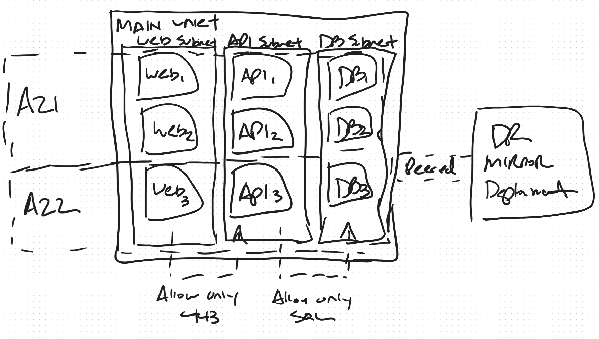

# Example: Availability Zone Distribution with Port-Specific NSGs and DR Peering

## The Diagram



A hand-drawn sketch showing a single VNet with three subnets, VMs distributed across two explicit availability zones, port-specific NSG annotations, and a peered DR mirror deployment.

## What I Saw

Reading the diagram:

1. **"Main VNet"** — one VNet containing three side-by-side subnets:
   - **Web Subnet** with Web₁, Web₂, Web₃
   - **API Subnet** with API₁, API₂, API₃
   - **DB Subnet** with DB₁, DB₂, DB₃
2. **Availability Zone markers on the left side:**
   - **AZ1** spans the top two rows (Web₁/Web₂, API₁/API₂, DB₁/DB₂)
   - **AZ2** spans the bottom row (Web₃, API₃, DB₃)
   - A dashed horizontal line separates AZ1 from AZ2
3. **Two NSG annotations at the bottom:**
   - "Allow only 443" with an arrow pointing up into **API Subnet**
   - "Allow only SQL" with an arrow pointing up into **DB Subnet**
4. **"DR Mirror Deployment"** — a separate box on the right, connected by a dashed line labeled "Peered" to the DB Subnet area of the Main VNet.

## How I Translated It

### Step 1: Identify the relational tables needed

| Diagram Element | AzRI Table | Key(s) |
|----------------|------------|--------|
| Main VNet | `networks` | `main` |
| Web, API, DB Subnets | `networks.main.subnets` | `web`, `api`, `db` |
| Web₁-₃, API₁-₃, DB₁-₃ | `virtual_machine_sets` | `web`, `api`, `db` |
| AZ1 / AZ2 labels | `virtual_machine_set_zone_distribution` | `web`, `api`, `db` |
| "Allow only 443" | `network_security_rules` + `network_ports` | `allow_https_to_api` |
| "Allow only SQL" | `network_security_rules` + `network_ports` | `allow_sql_to_db` |
| DR Mirror Deployment | `external_networks` | `dr_mirror` |
| "Peered" line | `networks.main.peered_to` | `["dr_mirror"]` |

### Step 2: Availability Zone Distribution

The diagram is deliberate about zone placement. The dashed line and "AZ1" / "AZ2" labels show:

- **AZ1**: 2 VMs per role (top two rows)
- **AZ2**: 1 VM per role (bottom row)

This is NOT the AzRI default (even distribution across all three zones). It's a custom 2:1 split across 2 zones. This mapped to `virtual_machine_set_zone_distribution` with a `custom` distribution:

```hcl
virtual_machine_set_zone_distribution = {
  web = {
    custom = {
      "1" = 2  # 2 VMs in AZ1
      "2" = 1  # 1 VM in AZ2
    }
  }
  api = {
    custom = {
      "1" = 2
      "2" = 1
    }
  }
  db = {
    custom = {
      "1" = 2
      "2" = 1
    }
  }
}
```

> Without this override, AzRI would spread 3 VMs as 1-1-1 across zones 1, 2, and 3. The architect explicitly drew a different layout — the TFVARS must match.

### Step 3: Port-Specific NSG Rules

The diagram specifies exact protocols:

- **"Allow only 443"** → HTTPS to the API Subnet
- **"Allow only SQL"** → SQL Server port to the DB Subnet

This required a `network_ports` table to name the ports:

```hcl
network_ports = {
  https = "443"
  sql   = "1433"  # REVIEW: Could be 3306 (MySQL) or 5432 (PostgreSQL)
}
```

The "allow only" phrasing implies a deny-all baseline, so each restricted subnet gets:
1. A `deny_all_inbound` rule first
2. A port-specific `allow` rule that references `port_names`

```hcl
allow_https_to_api = {
  port_names = ["https"]  # 🔗 Links to network_ports
  protocol   = "Tcp"
  allow = {
    in = {
      to = { subnet = { network_name = "main", subnet_name = "api" } }
    }
  }
}
```

> The source isn't specified in the diagram — just "allow only 443." I allowed from anywhere since the arrows point upward generically. This is a reasonable default but worth reviewing.

For the SQL rule, I scoped the source to the API subnet — in a web→api→db architecture, the API tier is the natural caller:

```hcl
allow_sql_to_db = {
  port_names = ["sql"]
  protocol   = "Tcp"
  allow = {
    in = {
      from = { subnet = { network_name = "main", subnet_name = "api" } }
      to   = { subnet = { network_name = "main", subnet_name = "db" } }
    }
  }
}
```

### Step 4: The DR Mirror — A Lesson in Structural Ambiguity

The "DR Mirror Deployment" box was the most interesting element. I modeled it as an `external_networks` entry — an opaque external system peered into the main VNet:

```hcl
external_networks = {
  dr_mirror = {
    address_space = "10.200.0.0/16"  # REVIEW
    resource_id   = null              # REVIEW
    subnets       = {}
  }
}
```

**This turned out to be wrong.** The architect's intent was: *"Mirror this entire architecture in a second region and peer the two together."* That's not an external network — it's a duplication instruction that doubles the TFVARS output: a second location, a second set of networks, VMs, subnets, and key vaults, plus cross-region peering.

**Why I got it wrong:** I treated ambiguity as a leaf-value problem (fill in the blanks, mark `# REVIEW`). But this was a **structural** ambiguity — it changes the shape of the entire output, not just one field. You can't fix "I modeled one region instead of two" by editing a single value.

**The correct action was to stop and ask:**

> "The DR Mirror Deployment — do you mean replicate this entire architecture in a second Azure region and peer them together, or is this an existing external environment that you're peering into?"

### The Decision Framework

This example teaches a critical distinction in how gaps should be handled:

| Signal in the Diagram | Type of Ambiguity | Correct Action |
|----------------------|-------------------|----------------|
| Missing CIDR range | Leaf value | Best guess + `# REVIEW:` |
| Missing port number | Leaf value | Best guess + `# REVIEW:` |
| No subscription ID | Leaf value | Placeholder + `# REVIEW:` |
| "DR Mirror" / "Hub" / "Replicate" | **Structural** | **Stop and ask the architect** |
| Unclear subscription boundaries | **Structural** | **Stop and ask the architect** |
| Ambiguous topology (hub-spoke vs. mesh) | **Structural** | **Stop and ask the architect** |

**Structural questions cascade.** Getting one wrong means regenerating the entire file, not editing a single line. That's why the AI must ask rather than guess.

## The Output

See [az_app.tfvars](output.tfvars) for the complete generated file.

## What I Learned

1. **Availability zone annotations map directly to `virtual_machine_set_zone_distribution`.** The architect drew exactly what they meant — 2:1 across 2 zones — and the relational model has a first-class way to express it.
2. **Port-specific rules need `network_ports` as a lookup table.** "Allow only 443" requires a named port entry before security rules can reference it via `port_names`.
3. **"Allow only" implies deny-all.** The rule order in `security_rules` lists matters — deny first, then allow overrides.
4. **Structural ambiguity must be resolved by asking, not guessing.** A `# REVIEW` comment can't fix "you built the wrong architecture." When a diagram element could change the topology, stop and ask.
5. **Single VNet vs. multi-VNet changes everything downstream.** This diagram uses one VNet with co-located subnets, simplifying NSG rules and eliminating cross-VNet peering concerns. The architecture is simpler — but only because the architect drew it that way.
